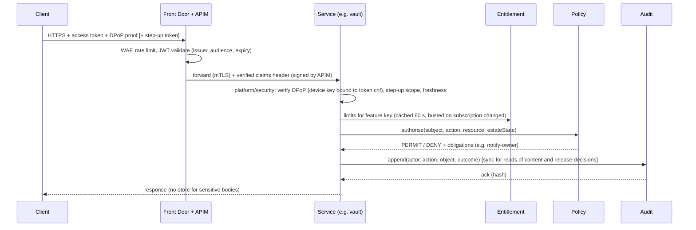

# 03. Modules, boundaries and deployables

## 3.1 Modules (one per FRS 8.2 component)

Each module is a Gradle project pair: `:<m>:api` (Kotlin interfaces, DTOs, events) and `:<m>:impl`
(controllers, services, persistence). Rules:

1. A module depends only on other modules' `:api` and on `platform/*`. ArchUnit tests and Gradle
   dependency constraints enforce this.
2. A module owns one Postgres schema with its own DB role. No module reads another's schema. Each
   role has `USAGE` on its own schema only.
3. Cross-module calls go through the `:api` interface. Inside one deployable, that is an in-process
   call. Across deployables, a generated internal HTTP client (mTLS through the Istio mesh)
   implements the same interface. Callers can't tell the difference, so modules can move between
   deployables without code changes.
4. State changes publish domain events through a transactional outbox (D-025).

| Module | FRS component | Owns (schema) | Key FRs | Pool |
|---|---|---|---|---|
| `identity` | Identity service | users, devices, consents, mobile verifications, step-up challenges, invitations, deletion requests, ID-verification checks | ONB-001..007, 009, 011 | A |
| `entitlement` | Entitlement service | entitlement grants, trial usage, plan catalogue snapshot, group codes and attribution | SUB-001, 003, 004, 007, 008, ONB-010 | A |
| `billing` | Billing service | subscriptions, store transactions, Paystack payments, invoices, add-on orders | SUB-002, 005, 006 | A |
| `policy` | Policy service (ABAC) | role grants, release rules, decision cache epoch | PRM-001..007 | **B** |
| `audit` | Audit service | append-only hash-chained events | VLT-009, PRM-005, NFR-AUD-001 | **B** (own DB) |
| `score` | Score service | assessments, scores, score history, life events, action lists | SCR-001..009 | A |
| `will` | Will service | wills, versions, allocations, bequests, nominations, executions, codicils | WIL-001..014, 017, 018 | A |
| `estate` | Estate service | estates, persons, assets, liabilities, value history | AST-*, FAM-* | A |
| `wallet` | (part of Estate in FRS 8.2) | net-worth snapshots, balance-update prompts, household goals | WAL-001..004 | A |
| `vault` | Vault service | folders, document metadata, wrapped data keys, quota usage, scan results | VLT-001..011 | **B** |
| `extraction` | Extraction service | extraction jobs (transient, deleted after confirmation or 7 days) | AST-005, VLT-004 | **B** |
| `simulation` | Simulation service | scenarios, results, rule-table versions | SIM-*, LIQ-* | A |
| `lifecycle` | Lifecycle service | check-in settings, check-ins, verifiers, verification and activation cases, evidence, estate-state machine | DMS-001..007, ACT-001..008 | **B** |
| `executor` | Executor service | estate files, checklist state, deadlines, institution requests, claims register, realised values, beneficiary updates, co-executor grants | EXE-001..013 | **B** |
| `digital` | (Vault/Release in FRS 8.1) | digital assets (masked identifiers, wishes, recovery-location references), sealed-instruction ciphertext | DIG-001..004 | **B** |
| `trust` | (Estate in FRS 8.2) | existing trusts, suitability questionnaire responses | TRS-001..003, FAM-007 | A |
| `marketplace` | Marketplace service | professionals, verification evidence, listings, bookings, case bundles, reviews, listing subscriptions | MKT-001..008, WIL-016 | A |
| `ai` | AI adviser service | conversations (redacted, 90 days), quota usage, knowledge-base index, evaluation runs | AI-001..006 | **C** |
| `emergency` | (FR-EMG; FRS places it in Vault/Release) | card config, widget tokens, emergency package | EMG-001..003 | A (package release decisions go through `policy`) |
| `notification` | Notification service | preferences, templates, push tokens, inbox, delivery log | NTF-001..004, 006 | A |
| `docgen` | Document generation | none (renders on demand, writes outputs to the vault) | WIL-010, VLT-010, ONB-011 export | A |
| `backoffice` | Back-office console API | support notes, quarantine decisions, case assignments and four-eyes decisions, professional vetting, review moderation, content publishing | D-014, ACT-003, MKT-002, MKT-006 | A (calls B through policy) |

## 3.2 Deployables (D-020)

| Deployable | Modules | Node pool | Database server | Scales on |
|---|---|---|---|---|
| `lifa-core` | score, will, estate, wallet, simulation, emergency, notification (API) | A | `pg-a` | CPU, RPS |
| `lifa-identity` | identity | A | `pg-a` | RPS (login peaks) |
| `lifa-commerce` | entitlement, billing (incl. inbound webhooks) | A | `pg-a` | RPS |
| `lifa-protected` | vault, policy, extraction | **B** | `pg-b` | CPU, upload concurrency |
| `lifa-lifecycle` | lifecycle | **B** | `pg-b` | Service Bus backlog |
| `lifa-executor` | executor, digital | **B** | `pg-b` | RPS |
| `lifa-marketplace` | marketplace, trust | A | `pg-a` | RPS |
| `lifa-ai` | ai | **C** (own namespace, egress only to the LLM provider) | `pg-ai` (pgvector) | RPS, token budget |
| `lifa-audit` | audit | **B** | `pg-ledger` | write rate |
| `lifa-workers` | docgen, notification dispatch, malware scan (ClamAV sidecar), extraction workers | split: `workers-a` (docgen, notify) on A, `workers-b` (scan, extract) on B | per module | Service Bus backlog (KEDA) |
| `web-bff` | session, token holding, CSRF, proxies to APIM | A | Redis (session, encrypted) | RPS |
| `backoffice-bff` | staff SSO (Entra workforce tenant), JIT role checks | A | — | — |

Pool C isolation (D-031): `lifa-ai` cannot reach pool B or `pg-a`. It receives plan data only from
`lifa-core`'s redaction endpoint (consent checked, ID and account numbers removed, FR-AI-002/005), and its only
egress is the LLM provider endpoint, through an Azure Firewall FQDN rule.

Pool B isolation (FRS 8, 9.1):
- Separate AKS node pool with taints. Only pool-B workloads have Managed HSM `wrapKey/unwrapKey` rights, through Workload Identity.
- Separate Postgres Flexible Server (`pg-b`) and a separate storage account for documents. Pool A has no network route or RBAC to either.
- Istio `AuthorizationPolicy`: pool A may call only `policy.authorise`, `vault.metadata` (no content) and `lifecycle.checkin` on pool B. Content endpoints are reachable only from APIM, with a step-up token.
- A compromise of `lifa-core` therefore yields no document content and no unwrapped keys.

## 3.3 Request path (every domain call)

- **Owner self-access**: owner access to their own living estate is still evaluated by `policy`. The
  decision is fast and cacheable for 30 s, keyed on (subject, estate, grant epoch).
- **Fail closed**: if `policy` or `audit` is unavailable, requests that read or release content fail
  with 503. Planning writes buffer audit events in the outbox, so availability (NFR-AVL-001) does not
  hinge on the ledger.

## 3.4 Domain events (Azure Service Bus topics)

| Topic | Producer | Consumers | FR |
|---|---|---|---|
| `estate.changed` | estate, will, vault, policy | score (rescore), wallet (snapshot) | SCR-006 |
| `person.minor-status-changed` | estate (nightly job) | score, will (warnings) | FAM-004, AT-FAM-01 |
| `will.signed`, `will.stale` | will | score, notification | WIL-012, WIL-017 |
| `life-event.declared` | score | will (stale flag), notification | SCR-008, WIL-017 |
| `document.uploaded` | vault | scan → classify → (extraction) | VLT-004, VLT-008 |
| `document.expiring` | vault (daily) | notification (60/30/7 days) | VLT-006 |
| `grant.changed` / `grant.revoked` | policy | all policy-client caches (epoch bump) | PRM-006 |
| `access.occurred` | policy (obligation) | notification → owner | PRM-005 |
| `subscription.changed` | billing | entitlement → `entitlement.changed` | SUB-002, 004, 005 |
| `entitlement.changed` | entitlement | clients (silent push), services' caches | SUB-001 |
| `checkin.due`, `checkin.missed`, `verifier.notify` | lifecycle | notification | DMS-002, 003 |
| `case.opened`, `case.cancelled` | lifecycle | backoffice, notification | DMS-004, 006 |
| `account.deletion-requested`/`-executed` | identity | every module (purge), vault (crypto-shred) | ONB-011 |
| `activation.requested`, `activation.notice-started`, `activation.completed`, `activation.cancelled` | lifecycle | policy (evaluate release rules), executor (create estate file), notification, entitlement (executor workspace or Executor Pack offer), marketing suppression | ACT-001..008, NTF-005 |
| `estate-file.updated` | executor | notification (beneficiary updates) | EXE-008 |
| `booking.created`, `bundle.expired` | marketplace | policy (time-boxed professional grant), notification | MKT-004 |
| `professional.verified`, `professional.reverify-due` | marketplace | backoffice, notification | MKT-002 |
| `notification.requested` | any | notification dispatcher | NTF-001 |

Messages carry IDs only, never estate content. The consumer fetches what it needs, with its own policy check.

## 3.5 Scheduled jobs

| Job | Owner | Schedule | FR |
|---|---|---|---|
| Minor-status recompute (age 18) | estate | nightly 01:00 SAST | FAM-004 |
| Will staleness (3 years) | will | nightly | WIL-017 |
| Value-age check (12 months) | estate | weekly | AST-009 |
| Document expiry reminders | vault | daily | VLT-006 |
| Check-in scheduler and escalation | lifecycle | every 15 min | DMS-001..003 |
| Monthly net-worth snapshot and balance prompt | wallet | monthly | WAL-002, 003 |
| Annual Legacy Review prompt | notification | daily (anniversary) | NTF-002 |
| Payment retry and downgrade after 14 days | billing | hourly | SUB-005 |
| Deletion after 30-day window and crypto-shred | identity, vault | hourly | ONB-011 |
| Audit chain export to immutable blob | audit | daily | NFR-AUD-001 |
| Extraction job purge (7 days) | extraction | daily | Data minimisation |
| Activation 72-hour notice timer | lifecycle | every 5 min | ACT-004 |
| Case SLA alerts (2 business days) | lifecycle | hourly | ACT-003, NFR-OBS-001 |
| Executor deadline reminders | executor | daily | EXE-004 |
| Estate file retention (5 years after distribution) | executor | daily | EXE-011 |
| Professional annual re-verification | marketplace | daily | MKT-002 |
| Booking case-bundle expiry | marketplace | hourly | MKT-004 |
| Listing subscription billing | marketplace + billing | daily | MKT-008 |
| AI quota reset and conversation purge (90 days) | ai | daily | AI-004, FRS 12.3 |
| Group code expiry | entitlement | daily | SUB-008 |
