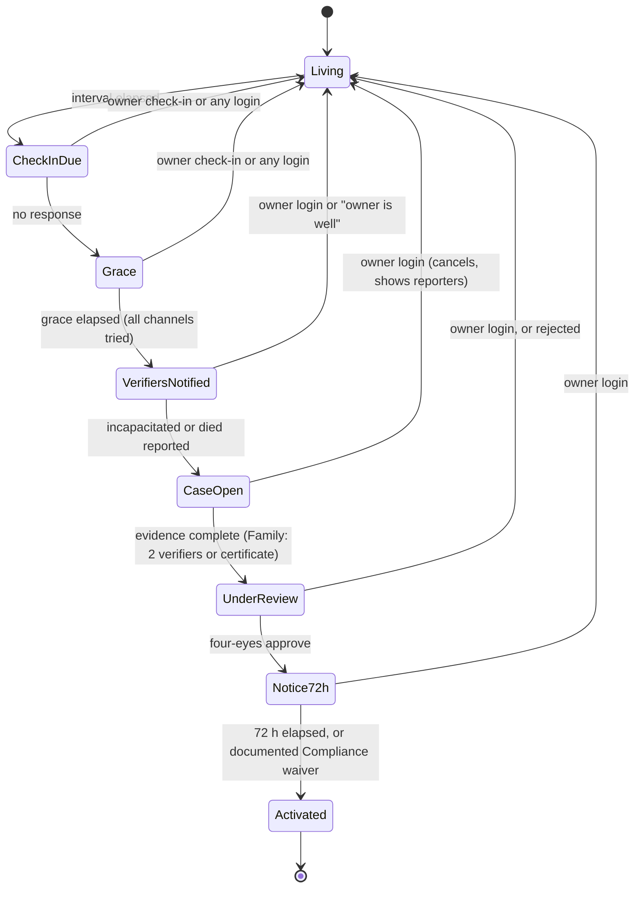

# 07. Threat model: vault, dead man's switch and activation

Method: STRIDE per data flow, with attacker profiles drawn from FRS 9.3. Each threat has an ID, the controls that
answer it (with FR/NFR references) and a verification test. Review this per epic (FRS 9.2 "threat modelling per
epic"). The independent penetration test before launch and the R3 red-team exercise test these assumptions.

## 1. Assets and attackers

| Asset | Why it matters |
|---|---|
| Vault documents (IDs, deeds, policies, wills, statements) | Identity theft, fraud, and family conflict if exposed |
| Release rules and grants | Changing them redirects what is released after death |
| Estate state (living / verifying / activated) | A false activation exposes a living person's whole private life (FRS 6) |
| Owner KEKs, document DEKs | Compromise of the HSM path means bulk decryption |
| Audit ledger | Evidence in disputes; must be tamper-evident |
| Owner identity (account, devices, mobile) | Account takeover is equivalent to all of the above |

| Attacker | Capability | Motive |
|---|---|---|
| A1 Relative or acquaintance | Knows personal facts, may hold the owner's phone or SIM, may be a named trusted person or verifier | Early access to inheritance information; influence the will |
| A2 Coercer | Physical presence with the owner | Force will or rule changes |
| A3 External criminal | Phishing, SIM swap, credential stuffing, malware on a device | Fraud with identity documents and account details |
| A4 Malicious or careless insider | Lifa staff with operational access | Curiosity, sale of data |
| A5 Compromised workload | Remote code execution in a pool-A service or a dependency | Bulk exfiltration |
| A6 Cloud or supplier compromise | Push providers, SMS provider, app stores | Metadata harvesting, message spoofing |

Trust boundaries: device ↔ edge (TLS + pinning) · edge ↔ APIM · APIM ↔ pool A · **pool A ↔ pool B** · pool B ↔
Managed HSM / documents storage · services ↔ audit ledger · staff ↔ back office · Lifa ↔ third parties.

## 2. Vault (Release A)

Flows: upload (device → APIM → vault → ClamAV → HSM wrap → blob), read by the owner, read by a trusted person under
a rule, metadata listing, deletion and crypto-shred, back-office support.

| ID | STRIDE | Threat | Controls | Verification |
|---|---|---|---|---|
| V-S1 | Spoofing | Account takeover via SIM swap, then vault read | SMS is never sufficient for `vault.*` step-up (FRS 9.3); step-up needs a device-key signature or WebAuthn; Clickatell SIM-swap check on OTP; new devices start at reduced trust and alert existing devices (06 §6.2) | Integration test: SMS-only session → 401 `step_up_required` on content; SIM-swap flag → OTP refused |
| V-S2 | Spoofing | Stolen access token replayed from another device | DPoP binding (`cnf.jkt`), `jti` replay cache, 10-min tokens | Contract test: token + wrong-key proof → 401 |
| V-S3 | Spoofing | Unlocked phone in a relative's hands (A1) | Biometric re-auth on cold start and after 5 min (FR-ONB-005); per-request step-up for content (FR-ONB-006); `FLAG_SECURE` / screenshot blurring | UI tests per platform |
| V-T1 | Tampering | Malicious upload targeting parsers (PDF, HEIC, DOCX) | Type allow-list by magic bytes, 25 MB cap (FR-VLT-001), ClamAV scan before storage (FR-VLT-008), classifier and extractor run in pool B with seccomp, no network egress, read-only filesystem | EICAR and polyglot test files in CI |
| V-T2 | Tampering | Change of a release rule or grant by a coercer (A2) or a takeover | Step-up `release.write` / `grant.write`; owner notified on all channels; change history visible in the audit view; **cooling-off notice** for large beneficiary changes (FRS 9.3) | AT-PRM tests; audit assertions |
| V-T3 | Tampering | Blob replaced or rolled back in storage | AES-256-GCM with the document ID and version as associated data; stored SHA-256 checked on read; blob versioning + soft delete; writes only through the vault identity | Unit test: swapped blob → integrity error, audited |
| V-R1 | Repudiation | "I never opened that document" | Synchronous audit write **before** content is returned, failing closed (D-025); hash chain; daily anchor to immutable storage (NFR-AUD-001); owner-visible activity (FR-VLT-009) | Chaos test: audit down → content 503 |
| V-I1 | Information disclosure | Pool-A compromise (A5) reads documents | Pool isolation: separate node pool, DB server, storage account, HSM rights only for pool-B identities, Istio deny by default (03 §3.2) | Network policy tests; Terraform policy checks (no pool-A role on vault resources) |
| V-I2 | Information disclosure | Insider (A4) reads content | Staff have no content endpoints (backoffice spec); content decryptable only with the owner KEK through pool B; JIT access; Sentinel alerts on staff access to pool B | Back-office API has no content routes (lint check); PIM audit |
| V-I3 | Information disclosure | Trusted person sees more than intended | ABAC deny by default (FR-PRM-001); denied reads return 404; revocations reach caches within 60 s (FR-PRM-006, AT-PRM-01); exhaustive policy decision table tests | Property-based tests on the policy function; AT-PRM-01 |
| V-I4 | Information disclosure | Lock screen, push or OS previews leak content | Generic push titles only (FR-NTF-004, AT-NTF-01); widget is opt-in and limited to selected fields (D-017); app-switcher snapshot is blurred | AT-NTF-01 on each platform |
| V-I5 | Information disclosure | Logs and telemetry capture content or IDs | Structured logging with an allow-list of fields; redaction processor; Application Insights PII masking; secret detector never logs matches (06 §6.6) | Log-scanning test in CI (seeded canary values must never appear) |
| V-I6 | Information disclosure | Owner stores seed phrases or passwords, which Lifa then holds | FR-VLT-011 detector holds the upload and warns; education copy; digital legacy holds no credentials (FR-DIG-002) | Detector unit tests (BIP-39, xprv, PEM) |
| V-I7 | Information disclosure | Local cache on a lost device | SQLCipher (or platform equivalent) keyed by a hardware key that needs user authentication; document bytes in memory only; remote device revoke | Device test: cache file is unreadable without unlock |
| V-D1 | Denial of service | Upload floods exhaust storage or the scanner | Quotas per tier (FR-VLT-003), per-user upload rate limit at APIM, KEDA scaling for scanners, upload concurrency limits | Load test |
| V-E1 | Elevation of privilege | IDOR across estates through document IDs | Every request evaluated by policy with `(subject, estate, item)`; IDs are random UUIDs; no listing across estates | Automated IDOR suite (two users, every route) |
| V-K1 | Key compromise | Unwrapped DEK or field key held in memory leaks | Keys live in memory ≤ 5 min, are zeroised after use where the JVM allows, are never serialised; no heap dumps in production; pool-B nodes are confidential VMs where available | Code review checklist; heap-dump setting audited |
| V-K2 | Key compromise | Bulk unwrap by a compromised pool-B workload | HSM rate limits and Sentinel anomaly rule on unwrap volume per minute; unwrap requests carry the owner ID and are audited | Alert rule test |
| V-K3 | Key management | Per-owner KEK count or cost limits in Managed HSM | Closed: one HSM key per owner confirmed at target scale (D-028) | — |

## 3. Dead man's switch and activation

Release A now builds the switch, verifier reports, case review **and activation** (D-027). Activation stays
switched off in production (`release.activation`) until the FRS 13.2 red-team exercise of false activation fails to
activate (D-026). Only the `lifecycle` DB role can write `estate.state` (05 §5.4), and an ArchUnit rule stops any
other module calling the transition API.

| ID | STRIDE | Threat | Controls | Verification |
|---|---|---|---|---|
| A-S1 | Spoofing | Relative (A1) reports a false death to gain access | The switch never declares death (FRS 5.4); Family needs 2 verifiers or a certificate (FR-DMS-005, AT-DMS-01); activation needs documentary evidence, a requester-matches-role check (FR-ACT-002), four-eyes review (FR-ACT-003) and a 72-hour notice to every owner channel (FR-ACT-004); **any owner login cancels** (FR-DMS-006, AT-ACT-01) | AT-DMS-01, AT-ACT-01; R3 red-team gate (FRS 13.2) |
| A-S2 | Spoofing | Forged death certificate | Review checklist includes Home Affairs verification through the ID-verification vendor (B6) where available; certificate hash and metadata kept; Compliance escalation for doubtful cases | Checklist review; red-team gate |
| A-S3 | Spoofing | Verifier account taken over | Verifiers authenticate and step up like any user; verifier reports from new or reduced-trust devices are flagged for review | Integration test |
| A-T1 | Tampering | Insider approves their own case or alters evidence | Four-eyes with two distinct reviewers enforced in the database (`case_decisions` unique reviewer per case and a check that reviewer ≠ opener); evidence in an immutable-policy container; every step audited (FR-ACT-008) | DB constraint tests |
| A-T2 | Tampering | Check-in messages suppressed (SIM swap, email rules) so the switch escalates | Every channel is attempted (FR-DMS-003); delivery receipts monitored, and failed check-in delivery alerts operations (NFR-OBS-001); any authenticated session counts as a check-in (FR-DMS-002) | DMS end-to-end test incl. SIM-swap case (FRS 13.2) |
| A-R1 | Repudiation | Disputed "who reported and when" | Owner sees reporters and times (AT-ACT-01); full audit with evidence references | AT-ACT-01 |
| A-I1 | Information disclosure | Verifier messages reveal estate details | Verifier requests carry only the owner's first name and the question (FR-DMS-003); no links to estate data; signed, expiring links (FRS 9.3) | Template snapshot tests |
| A-I2 | Information disclosure | Invitation scraping | Signed single-use tokens, short expiry, rate-limited lookup, redacted public view (FR-NTF-006) | Fuzz test on the invitation endpoint |
| A-D1 | Denial of service | A traveller misses check-ins and triggers escalation | Pause for up to 180 days (FR-DMS-007); grace period of 7–30 days; reminders on every channel | DMS travel-pause case (FRS 13.2) |
| A-E1 | Elevation of privilege | Release-rule evaluation bug releases items while the estate is still living | The policy function requires `estate.state = activated` for death rules (and an incapacity activation for incapacity rules, FR-ACT-007); death+executor-approval rules also need the executor's recorded approval; property tests over all rule × state pairs | Exhaustive decision-table test |
| A-E3 | Elevation of privilege | Waiver of the 72-hour notice abused | Waiver only by the `compliance_officer` role, with a documented reason (FR-ACT-004); Sentinel alert on every waiver; owner channels still notified | Role test; alert rule test |
| A-I3 | Information disclosure | Staff browse evidence or estate content during review | Evidence access needs a second staff approval and expires after 30 minutes (back-office spec); owner content is never shown to staff | DB constraint and API tests |
| A-E2 | Elevation of privilege | Coercer (A2) forces the owner to change verifiers or disarm the switch | Step-up on settings changes; change notification to the previous verifiers ("settings changed", no details); history visible to the executor after activation (FRS 9.3) | Integration test |

## 4. Executor workspace

| ID | Threat | Controls |
|---|---|---|
| E-1 | Executor sees more than released | The estate file is built only from items released to the executor by rule (FR-EXE-001) plus the inventory snapshot; documents are still served through policy |
| E-2 | A co-executor, attorney or agent exceeds their role | Member scopes are enforced by policy; inviting needs step-up; removal is immediate (FR-EXE-009, FR-PRM-006) |
| E-3 | Lifa appears to act for the executor (legal risk, FR-EXE-013) | No outbound channel to institutions exists in code; letters are generated as PDFs for the executor to send; every screen and response carries the executor-acts-alone disclosure |
| E-4 | Estate file kept too long or deleted too early | Retention job with documented extensions (FR-EXE-011); deletion audited |

## 5. Marketplace

| ID | Threat | Controls |
|---|---|---|
| M-1 | Fake or unlicensed professional listed | Registration evidence checked by Operations against the LPC, FSCA or body register before going live, re-verified yearly (FR-MKT-002); advisers and insurers only if FSP-licensed (FR-MKT-007) |
| M-2 | Professional over-reaches on shared data | Case bundles are read-only, item-scoped, time-boxed policy grants; the owner is notified on each access; revocable at once |
| M-3 | Lifa holds client funds, or takes a fee share (regulatory) | Split payments settle to the professional's subaccount (B8); Lifa revenue is only the flat listing subscription; no commission code path |
| M-4 | Review manipulation, including pay-to-rank | Reviews only from completed bookings; moderation; ratings computed with no input from the listing tier (FR-MKT-008) |

## 6. AI adviser

| ID | Threat | Controls |
|---|---|---|
| I-1 | Plan data leaks to the model provider | Consent-gated (FR-AI-002); a redaction API removes ID and account numbers and names beyond first names (FR-AI-005); no-training, no-retention contract under POPIA s72 (NFR-PRV-001, A10); pool C egress only to the provider |
| I-2 | Prompt injection through user content | Uploaded-document text is never sent to the model; user questions are wrapped as data; retrieval only from the curated knowledge base (FRS 9.3) |
| I-3 | Answer amounts to legal, tax or product advice | Guardrail classifier on every answer part (FR-AI-003); blocked parts become "see a professional"; 300-question evaluation gate (FRS 13.2) |
| I-4 | Harm to a bereaved or distressed user | Crisis-language detection before the model; support resources, no product prompts (FR-AI-006) |
| I-5 | Quota abuse or cost blow-out | Per-user monthly quotas (FR-AI-004), per-request token caps, APIM rate limits |

## 7. Cross-cutting

| ID | Threat | Controls |
|---|---|---|
| T-X1 | Personal data leaves South Africa (NFR-PRV-001) through global services (Front Door edge, APNs, FCM, Huawei Push, Google Pub/Sub for Play RTDN, Entra) | Push and webhook payloads hold no personal or estate data (generic titles, opaque IDs); Front Door caches nothing on API routes; Entra residency confirmed in writing (A2); data-flow register kept in `docs/compliance/` |
| T-X2 | Supply-chain compromise of dependencies or the generator | Pinned versions, lockfiles, Dependabot with review, Sigstore/cosign signing of images, SBOM per build, admission policy on AKS (signed images only) |
| T-X3 | Mobile app repackaging | Play Integrity, App Attest, HMS Safety Detect and HarmonyOS attestation checked server-side at device registration and periodically; reduced trust on failure |
| T-X4 | Back-office account compromise | Workforce tenant with phishing-resistant MFA (FIDO2), PIM time-boxed roles, no content routes, session recording, Sentinel UEBA |

## 8. Residual risks to accept or decide

| Risk | Owner decision needed |
|---|---|
| Activation controls unproven until the red-team gate | Accepted: built now, switched on only after the gate (D-026, D-027) |
| LLM provider and transfer agreement not chosen | OPEN_QUESTIONS A10; `release.ai_adviser` stays off |
| Marketplace payment model needs Paystack and legal confirmation | OPEN_QUESTIONS B8 |
| An owner on a reduced-trust device cannot use the vault | Accepted: graceful degradation (06 §6.3) |
| SIM-swap checks depend on per-network API coverage | OPEN_QUESTIONS B2 |
