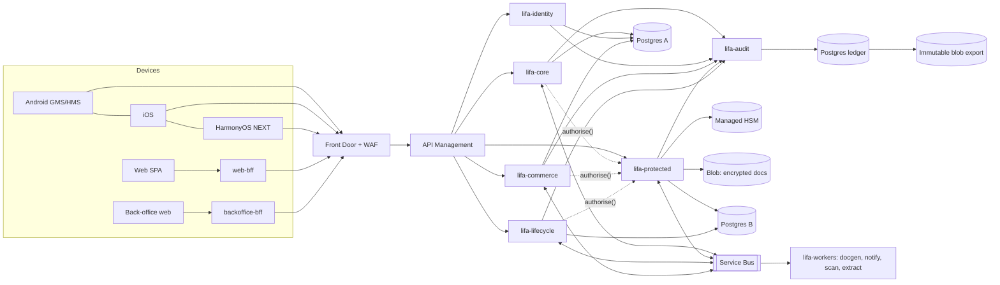

# Lifa architecture: Release A (R1 + R2)

Step 1 deliverable. Status: **draft for owner review**.
Source of truth: Lifa FRS v0.1 (7 Oct 2026). Requirement IDs are binding.

| # | Document | Contents |
|---|---|---|
| 01 | [Scope and release](01-scope.md) | What Release A contains, by FR ID, plus deviations |
| 02 | [Monorepo layout](02-monorepo.md) | Directory tree, build systems, code generation, CI layout |
| 03 | [Modules and deployables](03-modules-and-deployables.md) | Bounded contexts, dependency rules, node pools, events, request path |
| 04 | [API contracts](04-api-contracts.md) | OpenAPI conventions, the spec files, codegen per platform |
| 05 | [Data model](05-data-model.md) | FRS §10 mapped to modules, tables, classification, encryption and retention |
| 06 | [Identity, entitlements and security](06-identity-security.md) | Sign-up, MFA, device binding, step-up, entitlement enforcement, key hierarchy |
| 07 | [Threat model](07-threat-model.md) | STRIDE for the vault, the dead man's switch and activation (R3 design) |
| 08 | [Platform mapping](08-platforms.md) | Per-client capabilities, Android GMS/HMS flavours, HarmonyOS notes |
| 09 | [Traceability](09-traceability.md) | FR/NFR → module → API operation → test |

The OpenAPI specs live in [`/api/openapi`](../../api/openapi). Decisions and open questions are in
[`/DECISIONS.md`](../../DECISIONS.md) and [`/OPEN_QUESTIONS.md`](../../OPEN_QUESTIONS.md).

## One-paragraph summary

Lifa is a modular Kotlin/Spring backend on AKS in South Africa North, behind Front Door (WAF) and
API Management. Every domain request passes three shared platform checks before touching data:
identity (Entra External ID token, a DPoP device proof, and a step-up token where required),
entitlement (limits by feature key, never plan name) and policy (deny-by-default ABAC over role × item ×
estate state × release rule). It then lands in a hash-chained, append-only audit ledger. The vault,
policy and lifecycle modules run in an isolated node pool with their own database server, and only
they can call the Managed HSM, where per-owner keys wrap per-document data keys. Five clients (Android
GMS/HMS, web, iOS, HarmonyOS NEXT) and an internal back-office console call one versioned OpenAPI 3.1
contract through generated typed clients. Store and card billing reconcile server-side into a single
entitlement set.

